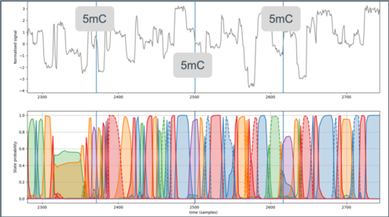

# Flappie

## Overview

Basecall Fast5 reads using _flip-flop_ basecalling.  

## Features

* Flip-flop basecalling for the MinION platform
  * R9.4.1 (Native or PCR libraries)
  * R10C (PCR libraries only)
* Basecalling of 5mC in CpG context for R9.4.1, PromethION platform

# Getting Started

## Input and Output

## Installation
Flappie has been tested on Ubuntu 16.04.5 LTS.  Other systems may be
compatible.

Flappie models and other large resources are stored using [git
lfs](https://git-lfs.github.com/) and this extension must be installed
to successfully clone the repository.

```bash
git clone https://github.com/nanoporetech/flappie
cd flappie
make flappie
```

An alternative location for the HDF5 library, for example one installed by `brew`, can be specified as:
```bash
hdf5Root=/usr/local/ make flappie
```

### Compilation From Source
Flappie has the following dependences
* [Cmake](https://cmake.org/) for building
* [CUnit](http://cunit.sourceforge.net/) library for unit testing
* [HDF5](https://www.hdfgroup.org/) library
* [OpenBLAS](https://www.openblas.net/) library for linear algebra


On Debian based systems, the following packages are sufficient (tested
Ubuntu 14.04 and 16.04)
* Running
  * libcunit1
  * libhdf5
  * libopenblas-base
* Building
  * cmake
  * libcunit1-dev
  * libhdf5-dev
  * libopenblas-dev


## Usage

```bash
#  ! It is highly recommended that OpenBLAS is run in single threaded mode
export OPENBLAS_NUM_THREADS=1
#  List available models
flappie --model help
#  Basecall reads directory
flappie reads/ > basecalls.fq
#  Basecall using a different model
flappie --model r941_5mC reads/ > basecalls.fq
#  Output to SAM (not compatible with modification calls)
flappie --format sam reads/ > basecalls.sam
#  Output to BAM (not compatible with modification calls)
flappie --format sam reads | samtools view -Sb - > basecalls.bam
#  Dump trace data
flappie --trace trace.hdf5 reads > basecalls.fq
#  Basecall in parallel
find reads -name \*.fast5 | parallel -P $(nproc) -X flappie > basecalls.fq
#  Dump trace in parallel.  One trace per parallel process.
find reads -name \*.fast5 | parallel -P $(nproc) -X flappie --trace trace_{%}.hdf5 {} > basecalls.fq
```

## Trace viewer

A basic trace viewer is supplied with _Flappie_, supporting trace output for both _Flappie_ and _Guppy_.





```
#  Set up
virtualenv -p python3 venv
source venv/bin/activate
pip install --upgrade pip
pip install -r misc/trace_requirements.txt

#  View a trace -- Flappie trace output
misc/trace_flipflop.py trace.hdf5

#  View a trace -- Guppy trace output
misc/trace_flipflop.py guppy_trace.fast5

#  View a trace -- Guppy trace output, additional analysis
misc/trace_flipflop.py --analysis 1 guppy_trace.fast5
```


# Help

## Licence and Copyright
(c) 2018 Oxford Nanopore Technologies Ltd.

Flappie is distributed under the terms of the Oxford Nanopore
Technologies, Ltd.  Public License, v. 1.0.  If a copy of the License
was not distributed with this file, You can obtain one at
http://nanoporetech.com


The vectorised math functions used by Flappie
[src/sse_mathfun.h](src/sse_mathfun.h) are from
http://gruntthepeon.free.fr/ssemath/ and the original version of this
file is under the 'zlib' licence.  See the top of
[src/sse_mathfun.h](src/sse_mathfun.h) for details.


## FAQs

###  Compilation failures

####  Git LFS missing
If you encounter compilation failures of the following form, the
repository was cloned without [git lfs](https://git-lfs.github.com/) and
the model files are missing.
```
/home/ubuntu/mounted/extensionBonusFlappie/flappie/src/models/flipflop_r941native.h:1:1: error: unknown type name ‘version’
version https://git-lfs.github.com/spec/v1
^~~~~~~
/home/ubuntu/mounted/extensionBonusFlappie/flappie/src/models/flipflop_r941native.h:1:14: error: expected ‘=’, ‘,’, ‘;’, ‘asm’ or ‘__attribute__’ before ‘:’ token
version https://git-lfs.github.com/spec/v1
              ^
/home/ubuntu/mounted/extensionBonusFlappie/flappie/src/models/flipflop_r941native.h:2:12: error: invalid suffix "fa49fa0ea6c67806f69fd6ba42a7dd935390b86f98a615ee03e167d22583" on integer constant
oid sha256:3979fa49fa0ea6c67806f69fd6ba42a7dd935390b86f98a615ee03e167d22583
            ^~~~~~~~~~~~~~~~~~~~~~~~~~~~~~~~~~~~~~~~~~~~~~~~~~~~~~~~~~~~~~~~
In file included from /home/ubuntu/mounted/extensionBonusFlappie/flappie/src/networks.c:4:0:
/home/ubuntu/mounted/extensionBonusFlappie/flappie/src/models/flipflop_r10Cpcr.h:2:12: error: invalid suffix "b2fe5fd1c3d9646e7a6ea76e646beb50ad6a5fe17e5da0c76c13bd907cb4" on floating constant
oid sha256:83e2b2fe5fd1c3d9646e7a6ea76e646beb50ad6a5fe17e5da0c76c13bd907cb4
            ^~~~~~~~~~~~~~~~~~~~~~~~~~~~~~~~~~~~~~~~~~~~~~~~~~~~~~~~~~~~~~~~
```

###  High system load
Extremely high system load can arise when Flappie is run using
`parallel` and OpenBLAS is used in multi-threaded mode.  Running in this
manner is harmful to overall throughput and it is recommended that
OpenBLAS is used in single-threaded manner, which can be enable by
setting the `OPENBLAS_NUM_THREADS` environmental variable to 1 (see top
of [Usage](#usage) for an example of how to do this).


###  Installing `git-lfs`
From [git lfs](https://git-lfs.github.com/), the installation
instructions for Debian based systems, like Ubuntu, are: 
```bash Ubuntu
curl -s https://packagecloud.io/install/repositories/github/git-lfs/script.deb.sh | sudo bash
sudo apt-get install git-lfs
git lfs install
```

###  Methylation and other modifications
Flappie currently only calls 5mC methylation in CpG contexts.  Calling
other modifications, or 5mC in other contexts, is not currently
supported.

Methylated calls are currently represented as a 'Z' base in the output
-- this is likely to break down-stream tools and may not be final format
in which this modification information is represented.  Outputting
methylation from _Flappie_ is enabled for early adopters to think about
how this information may be used; please do not rely on this particular
representation of modifications as it may change in the future.
Particularly, the `SAM` output when modification calling is enabled does
not conform to the published specification for that for format.

See https://github.com/nanoporetech/flappie/issues/11 and
https://github.com/samtools/hts-specs/issues/362 for more details of the issues
involved.


###  Platform support
The models contained contained in Flappie are trained using data from
the MinION platform.  Use on other platforms is not supported, although
they may generalise to reads from the GridION platform due to the
similarity of the hardware.

### Quality scores
The quality currently produced for FASTQ and SAM output are derived
directly from the probabilistic model output by the _Flappie_ model and
have not been calibrated.

### Trace file
The trace information is output as a block x state matrix, where the
states are the flip (uppercase) and flop (lowercase) bases in the order
ACGTacgt or ACGTZacgtz for methylated calls.  The probabilities for each
state are normalised into the range 0..255 and then represented by an
unsigned 8bit integer.  Due to rounding, the sum of encoded
probabilities for each block may not equal 255.

## Abbreviations

## References and Supporting Information
### Research Release
Research releases are provided as technology demonstrators to provide early access to features or stimulate Community development of tools.
Support for this software will be minimal and is only provided directly by the developers.
Feature requests, improvements, and discussions are welcome and can be implemented by forking and pull requests.
However much as we would like to rectify every issue and piece of feedback users may have, the developers may have limited resource for support of this software.
Research releases may be unstable and subject to rapid iteration by Oxford Nanopore Technologies.


